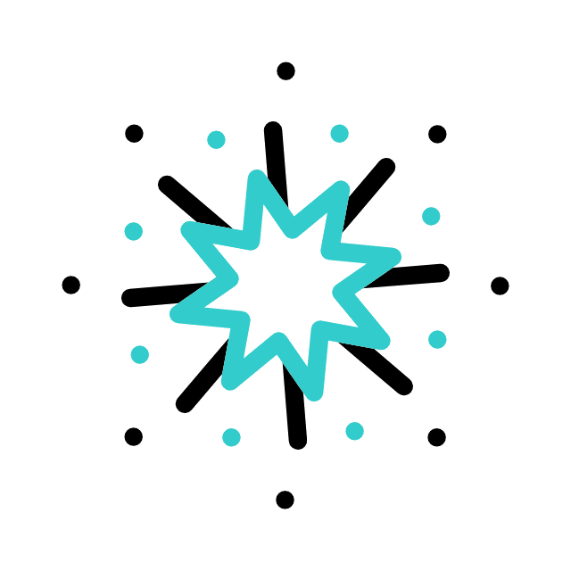
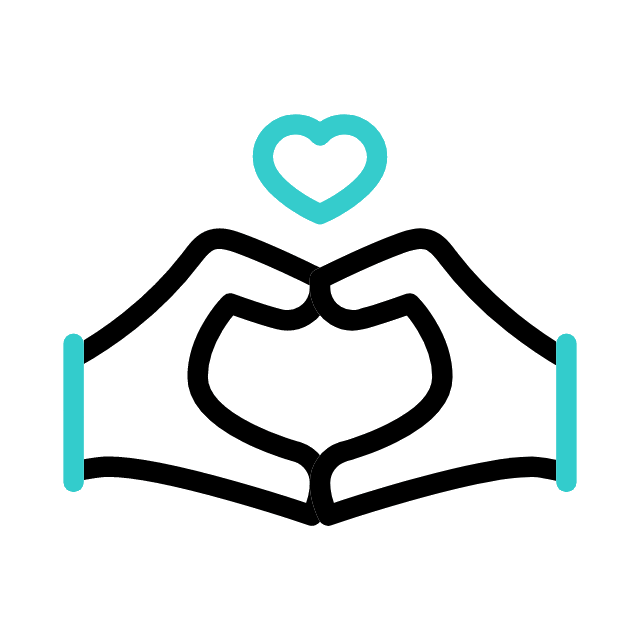
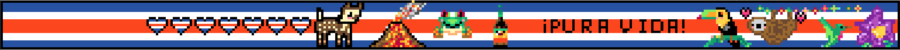

<h1 align="center">
  <b>Hi , I'm Josué Chaves </b>
  
</h1>

 

I'm a Software Engineer Student :technologist: at Instituto Tecnológico de Costa Rica. 
 
 
I'm passionate about generating solutions that can innovate and make a good impact on society.

 

## <b> About me</b>
 

<picture></picture>

- :computer: A passionate Web and XR developer.

- :briefcase: I’m currently open for an Intern or a new job opportunity, this is [my resume](https://drive.google.com/file/d/1UBDLmVWlkYxt_S8p31gB61Z5yoWqA-fY/view?usp=share_link)

 

 

## <b> Skills</b>
 

- **Languages**:
    
    
    
        
    	
    

    
    
- **Web Development**:

   
   
   
   
   
    
 

- **Softwares and Tools**:

    
    
    
    
    
    
    

 
 

-----

## <b> Let's Connect..!</b>
 

<ul>

<li>

</li>

 

<li>

</li>
	
</ul>

 

 
 
 

 
 
 
 

